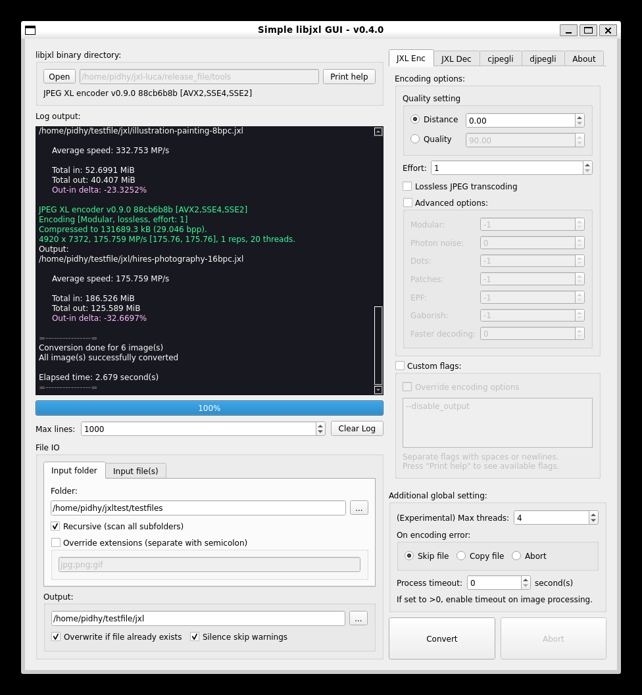
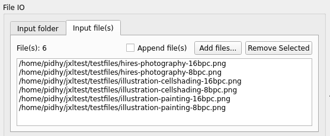

# JXL Batch Converter
A simple GUI for libjxl binaries, written in C++ with Qt.

*Or I could say a glorified batch command wrapped in GUI... :3*

(new in v0.3+) Drag and drop files / folder directly!

Currently tested on Windows 10 and WSL2 Ubuntu.

Features:
- cjxl, djxl, cjpegli, and djpegli
- Basic encoding parameters GUI
- Custom flags
- Single / multiple file mode
- Folder with / without recursive mode
- Set per-image processing timeout
- Options saved on exit (config file will be placed in user home)
- (Experimental) Multi-threading support (v0.4.0+)
- Copy file on encoding error (v0.4.0+)

**Notes on multi-threading**:
- I haven't fully tested the stability of multithread function. So far it works as intended. On my testing, at worst it only mangles the log output as different threads are writing on a single log *(race conditions woohoo!)*. I have no plans yet to group log outputs on different thread because of how the log works internally. So if you have difficulties reading the logs with multithreading, consider running with single thread instead. At the end, however, the reports are still giving the correct number of errors and successful processing.
- While doing recursive folder processing, it can sometimes trigger a failure when the tool is creating a new folder. If you managed to get this error, just rerun the tool again (make sure to disable **Overwrite**!).
- Because of the experimental flag, settings on multi threading will not be saved on exit and will revert back to 1 (single thread) on reopening the tool. 

Get libjxl binaries at the [official project page](https://github.com/libjxl/libjxl)!

## Few tips and tricks
### - Batch file a folder and all subfolders
1. Select **Input folder** tab on **File IO** section
2. Select your source folder and output folder
3. Enable **Recursive (scan all subfolders)** option

### - Separate encoding parameters for specific file extensions
*"I want to use X params for jpeg, but I want Y params for png!"*. Here's how you can do:
1. Select **Input folder** tab on **File IO** section
2. Make sure to have **Overwrite if file already exists** option on output disabled
3. Enable **Override extensions** option and add your preferred extension to use for first encoding parameters (eg. jpg)
4. Set your preferred parameters on **Encoding options**
5. Press **Convert**
6. Once done, repeat steps 3-5
