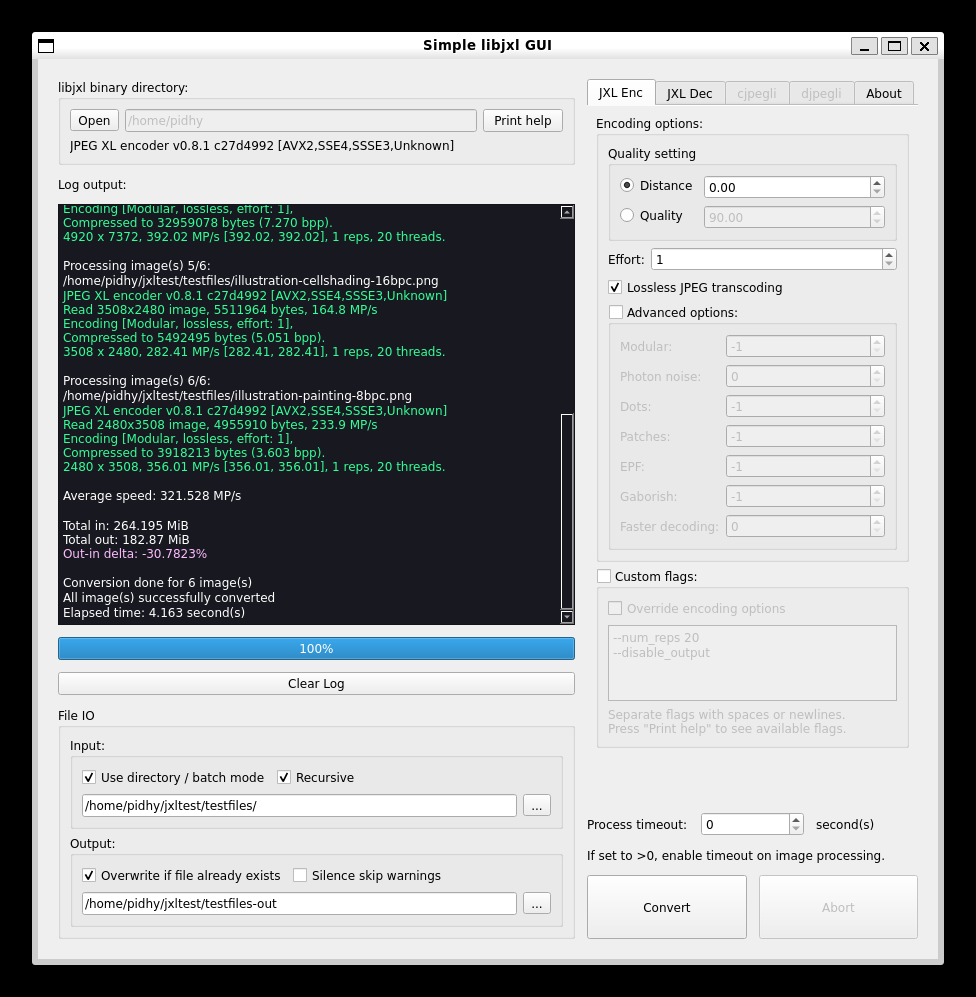

# JXL Batch Converter
A simple GUI for libjxl binaries, written in C++ with Qt.

Or I could say a glorified batch command wrapped in GUI... :3

Currently tested on Windows 10 and WSL2 Ubuntu.

Features:
- cjxl, djxl, cjpegli, and djpegli
- Basic encoding parameters GUI
- Custom flags
- Single / batch file mode
- Set per-image processing timeout
- Options saved on exit (config file will be placed in user home)
